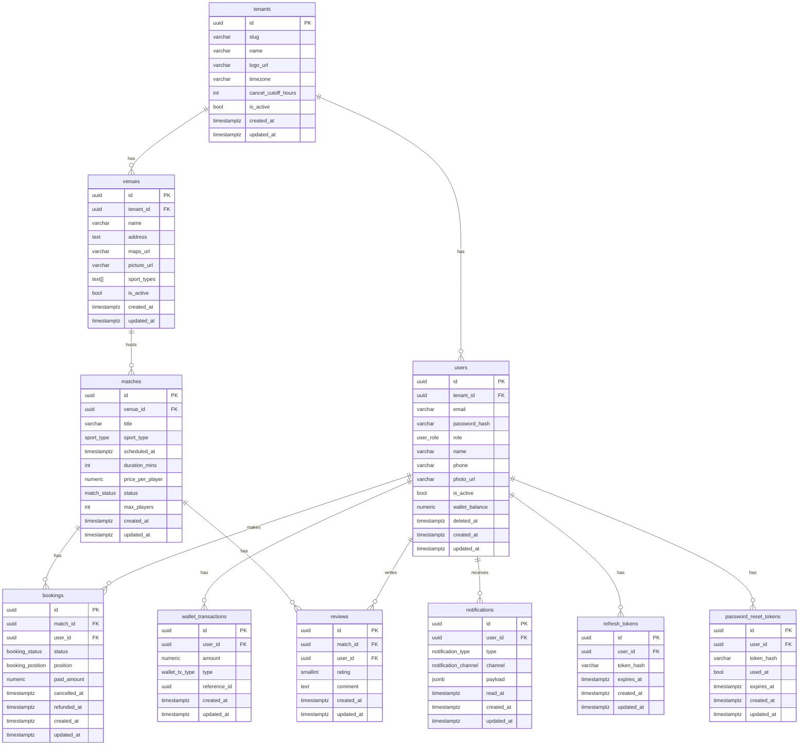
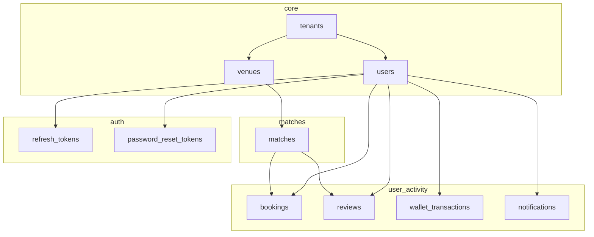

# SportBooker Database Migrations

Schema documentation and Entity Relationship Diagram for the SportBooker database.

---

## Migration Order

| # | File | Description |
|---|------|-------------|
| 001 | `001_create_enums.sql` | Enums: user_role, sport_type, match_status, booking_status, wallet_tx_type, notification_type, notification_channel |
| 002 | `002_create_tenants.sql` | Multi-tenant root table |
| 003 | `003_create_users.sql` | Users (tenant-scoped, soft delete, wallet) |
| 004 | `004_create_venues.sql` | Venues per tenant |
| 005 | `005_create_matches.sql` | Matches at venues |
| 006 | `006_create_bookings.sql` | User bookings for matches |
| 007 | `007_create_wallet_transactions.sql` | Wallet transaction history |
| 008 | `008_create_reviews.sql` | User reviews for matches |
| 009 | `009_create_notifications.sql` | User notifications |
| 010 | `010_create_refresh_tokens.sql` | JWT refresh token storage |
| 011 | `011_create_password_reset_tokens.sql` | Password reset token storage |
| 012 | `012_add_tenant_slug_and_is_active.sql` | Tenant slug + is_active flag |
| 013 | `013_add_tenant_timezone_and_user_roles.sql` | Tenant timezone; user role enum expansion |
| 014 | `014_add_unique_venue_name_per_tenant.sql` | Unique venue name per tenant |
| 015 | `015_add_unique_match_venue_scheduled.sql` | Unique (venue_id, scheduled_at) |
| 016 | `016_add_user_name_phone.sql` | User name + phone fields |
| 017 | `017_add_user_is_active.sql` | User is_active flag |
| 018 | `018_add_password_reset_used_at.sql` | Password reset used_at timestamp |
| 019 | `019_add_tenant_logo_cancel_cutoff_slug_length.sql` | Tenant logo, cancellation cutoff, slug length |
| 020 | `020_add_user_photo_url.sql` | User photo URL |
| 021 | `021_venues_maps_sport_types_is_active.sql` | Venue maps_url, sport_types array, is_active |
| 022 | `022_add_venue_picture_url.sql` | Venue picture_url |
| 023 | `023_venues_require_address_and_maps_url.sql` | Make venue address + maps_url NOT NULL |
| 024 | `024_matches_title_duration_enums.sql` | Match title, duration_mins; sport_type enum additions (padel, cricket, generic) |
| 026 | `026_bookings_paid_amount.sql` | Booking paid_amount column |
| 027 | `027_bookings_cancelled_refunded_at.sql` | Booking cancelled_at + refunded_at timestamps |
| 028 | `028_wallet_tx_type_topup.sql` | wallet_tx_type topup value |
| 029 | `029_bookings_partial_unique_match_user.sql` | Partial unique index: (match_id, user_id) where status IN (pending, confirmed) |
| 030 | `030_venues_sport_types_gin.sql` | GIN index on venues.sport_types |
| 031 | `031_booking_position.sql` | booking_position enum + bookings.position column |
| 032 | `032_add_platform_admin_user_role.sql` | platform_admin user role |

> Migration 025 (`025_matches_status_default_upcoming.sql`) was deleted when `match_status` was refactored to remove derived state from the DB (see Enums section below).

---

## Entity Relationship Diagram



---

## Relationship Overview (Text)

```
tenants
  ├── users (1:N)          — tenant_id
  └── venues (1:N)         — tenant_id

venues
  └── matches (1:N)        — venue_id

matches
  ├── bookings (1:N)       — match_id
  └── reviews (1:N)        — match_id

users
  ├── bookings (1:N)       — user_id
  ├── wallet_transactions (1:N) — user_id
  ├── reviews (1:N)        — user_id
  ├── notifications (1:N) — user_id
  ├── refresh_tokens (1:N) — user_id
  └── password_reset_tokens (1:N) — user_id
```

---

## Table Details

### tenants
| Column | Type | Constraints |
|--------|------|-------------|
| id | UUID | PK, DEFAULT gen_random_uuid() |
| slug | VARCHAR | NOT NULL, UNIQUE |
| name | VARCHAR(255) | NOT NULL |
| logo_url | VARCHAR | |
| timezone | VARCHAR | NOT NULL, DEFAULT 'UTC' |
| cancel_cutoff_hours | INT | NOT NULL, DEFAULT 24 |
| is_active | BOOL | NOT NULL, DEFAULT true |
| created_at | TIMESTAMPTZ | NOT NULL, DEFAULT now() |
| updated_at | TIMESTAMPTZ | NOT NULL, DEFAULT now() |

---

### users
| Column | Type | Constraints |
|--------|------|-------------|
| id | UUID | PK, DEFAULT gen_random_uuid() |
| tenant_id | UUID | NOT NULL, FK → tenants(id) ON DELETE CASCADE |
| email | VARCHAR(255) | NOT NULL |
| password_hash | VARCHAR(255) | NOT NULL |
| role | user_role | NOT NULL |
| name | VARCHAR | |
| phone | VARCHAR | |
| photo_url | VARCHAR | |
| is_active | BOOL | NOT NULL, DEFAULT true |
| wallet_balance | NUMERIC(10,2) | NOT NULL, DEFAULT 0 |
| deleted_at | TIMESTAMPTZ | (soft delete) |
| created_at | TIMESTAMPTZ | NOT NULL, DEFAULT now() |
| updated_at | TIMESTAMPTZ | NOT NULL, DEFAULT now() |

**Indexes:** idx_users_tenant_id, idx_users_email, idx_users_deleted_at  
**Unique:** (tenant_id, email)

---

### venues
| Column | Type | Constraints |
|--------|------|-------------|
| id | UUID | PK, DEFAULT gen_random_uuid() |
| tenant_id | UUID | NOT NULL, FK → tenants(id) ON DELETE CASCADE |
| name | VARCHAR(255) | NOT NULL |
| address | TEXT | NOT NULL |
| maps_url | VARCHAR(2048) | NOT NULL |
| picture_url | VARCHAR(2048) | |
| sport_types | TEXT[] | NOT NULL, DEFAULT '{}' |
| is_active | BOOL | NOT NULL, DEFAULT true |
| created_at | TIMESTAMPTZ | NOT NULL, DEFAULT now() |
| updated_at | TIMESTAMPTZ | NOT NULL, DEFAULT now() |

**Indexes:** idx_venues_tenant_id, GIN index on sport_types  
**Unique:** (tenant_id, name)

---

### matches
| Column | Type | Constraints |
|--------|------|-------------|
| id | UUID | PK, DEFAULT gen_random_uuid() |
| venue_id | UUID | NOT NULL, FK → venues(id) ON DELETE CASCADE |
| title | VARCHAR(500) | NOT NULL, DEFAULT 'Match' |
| sport_type | sport_type | NOT NULL |
| scheduled_at | TIMESTAMPTZ | NOT NULL |
| duration_mins | INT | NOT NULL, DEFAULT 60, CHECK ≥ 1 |
| price_per_player | NUMERIC(10,2) | NOT NULL |
| status | match_status | NOT NULL, DEFAULT 'scheduled' |
| max_players | INT | |
| created_at | TIMESTAMPTZ | NOT NULL, DEFAULT now() |
| updated_at | TIMESTAMPTZ | NOT NULL, DEFAULT now() |

**Indexes:** idx_matches_venue_id, idx_matches_scheduled_at, idx_matches_status  
**Unique:** (venue_id, scheduled_at)

> **Note:** Only `scheduled` and `cancelled` are ever stored in the DB. The values `upcoming`, `in_progress`, and `completed` are **computed at query time** using a SQL `CASE` on `scheduled_at` + `duration_mins` vs `now()`. See Enums section.

---

### bookings
| Column | Type | Constraints |
|--------|------|-------------|
| id | UUID | PK, DEFAULT gen_random_uuid() |
| match_id | UUID | NOT NULL, FK → matches(id) ON DELETE CASCADE |
| user_id | UUID | NOT NULL, FK → users(id) ON DELETE CASCADE |
| status | booking_status | NOT NULL, DEFAULT 'pending' |
| position | booking_position | NOT NULL, DEFAULT 'field_player' |
| paid_amount | NUMERIC(10,2) | NOT NULL, DEFAULT 0 |
| cancelled_at | TIMESTAMPTZ | |
| refunded_at | TIMESTAMPTZ | |
| created_at | TIMESTAMPTZ | NOT NULL, DEFAULT now() |
| updated_at | TIMESTAMPTZ | NOT NULL, DEFAULT now() |

**Indexes:** idx_bookings_match_id, idx_bookings_user_id  
**Partial unique:** (match_id, user_id) WHERE status IN ('pending', 'confirmed')

---

### wallet_transactions
| Column | Type | Constraints |
|--------|------|-------------|
| id | UUID | PK, DEFAULT gen_random_uuid() |
| user_id | UUID | NOT NULL, FK → users(id) ON DELETE CASCADE |
| amount | NUMERIC(10,2) | NOT NULL |
| type | wallet_tx_type | NOT NULL |
| reference_id | UUID | |
| created_at | TIMESTAMPTZ | NOT NULL, DEFAULT now() |
| updated_at | TIMESTAMPTZ | NOT NULL, DEFAULT now() |

**Indexes:** idx_wallet_transactions_user_id, idx_wallet_transactions_created_at

---

### reviews
| Column | Type | Constraints |
|--------|------|-------------|
| id | UUID | PK, DEFAULT gen_random_uuid() |
| match_id | UUID | NOT NULL, FK → matches(id) ON DELETE CASCADE |
| user_id | UUID | NOT NULL, FK → users(id) ON DELETE CASCADE |
| rating | SMALLINT | NOT NULL, CHECK (1–5) |
| comment | TEXT | |
| created_at | TIMESTAMPTZ | NOT NULL, DEFAULT now() |
| updated_at | TIMESTAMPTZ | NOT NULL, DEFAULT now() |

**Indexes:** idx_reviews_match_id, idx_reviews_user_id  
**Unique:** (match_id, user_id)

---

### notifications
| Column | Type | Constraints |
|--------|------|-------------|
| id | UUID | PK, DEFAULT gen_random_uuid() |
| user_id | UUID | NOT NULL, FK → users(id) ON DELETE CASCADE |
| type | notification_type | NOT NULL |
| channel | notification_channel | NOT NULL |
| payload | JSONB | |
| read_at | TIMESTAMPTZ | |
| created_at | TIMESTAMPTZ | NOT NULL, DEFAULT now() |
| updated_at | TIMESTAMPTZ | NOT NULL, DEFAULT now() |

**Indexes:** idx_notifications_user_id, idx_notifications_read_at

---

### refresh_tokens
| Column | Type | Constraints |
|--------|------|-------------|
| id | UUID | PK, DEFAULT gen_random_uuid() |
| user_id | UUID | NOT NULL, FK → users(id) ON DELETE CASCADE |
| token_hash | VARCHAR(255) | NOT NULL |
| expires_at | TIMESTAMPTZ | NOT NULL |
| created_at | TIMESTAMPTZ | NOT NULL, DEFAULT now() |
| updated_at | TIMESTAMPTZ | NOT NULL, DEFAULT now() |

**Indexes:** idx_refresh_tokens_user_id, idx_refresh_tokens_expires_at

---

### password_reset_tokens
| Column | Type | Constraints |
|--------|------|-------------|
| id | UUID | PK, DEFAULT gen_random_uuid() |
| user_id | UUID | NOT NULL, FK → users(id) ON DELETE CASCADE |
| token_hash | VARCHAR(255) | NOT NULL |
| used_at | TIMESTAMPTZ | |
| expires_at | TIMESTAMPTZ | NOT NULL |
| created_at | TIMESTAMPTZ | NOT NULL, DEFAULT now() |
| updated_at | TIMESTAMPTZ | NOT NULL, DEFAULT now() |

**Indexes:** idx_password_reset_tokens_user_id, idx_password_reset_tokens_expires_at

---

## Enums

| Enum | Values |
|------|--------|
| user_role | admin, user, venue_owner, platform_admin |
| sport_type | football, basketball, tennis, volleyball, padel, cricket, generic, other |
| match_status | **stored:** `scheduled`, `cancelled` — **computed:** `upcoming`, `in_progress`, `completed` (derived at query time from `scheduled_at + duration_mins` vs `now()`) |
| booking_status | pending, confirmed, cancelled |
| booking_position | field_player, goalkeeper |
| wallet_tx_type | credit, debit, refund, topup |
| notification_type | booking, reminder, match_update, wallet |
| notification_channel | email, sms, push |

---

## Simplified ERD (Flowchart)



---

## Running Migrations

```bash
npm run migrate
```

Requires: `DB_HOST`, `DB_PORT`, `DB_NAME`, `DB_USER`, `DB_PASSWORD` in `.env`.
